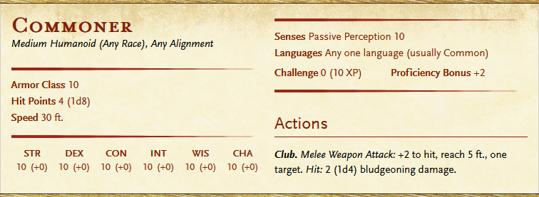
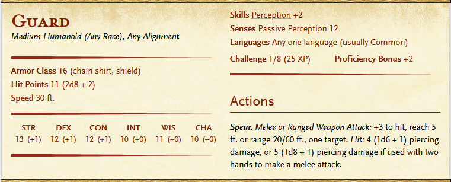
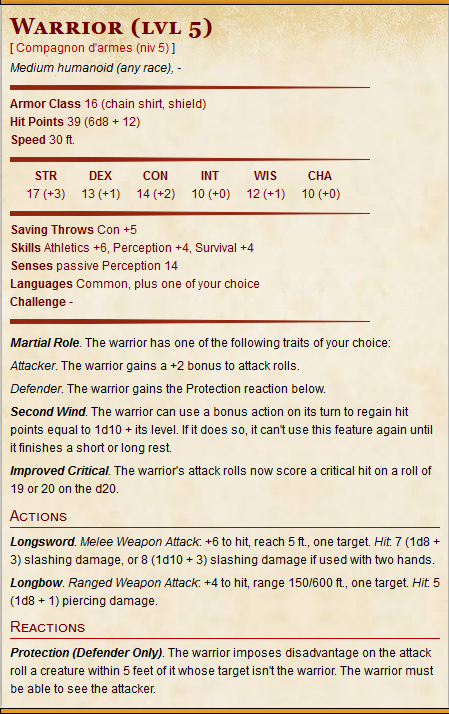
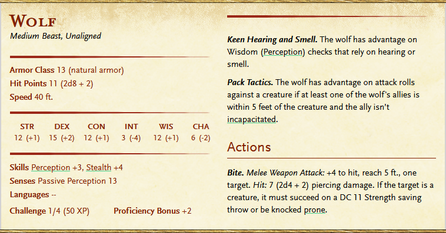
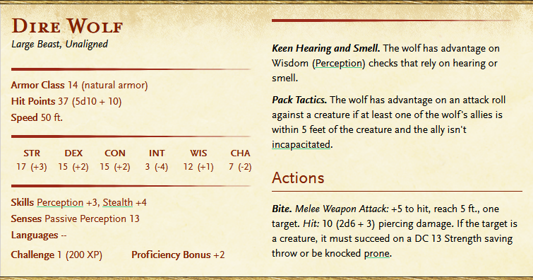
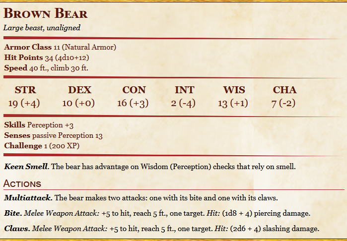
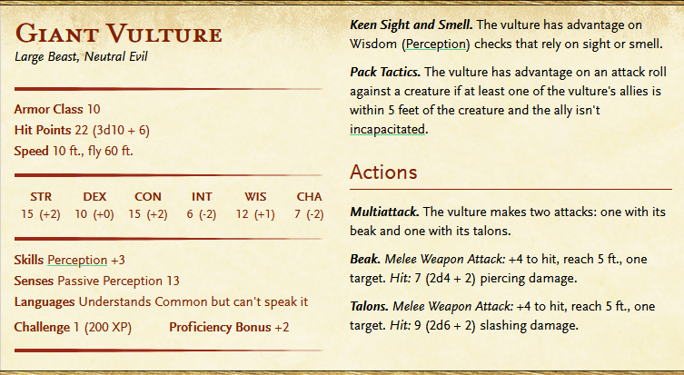
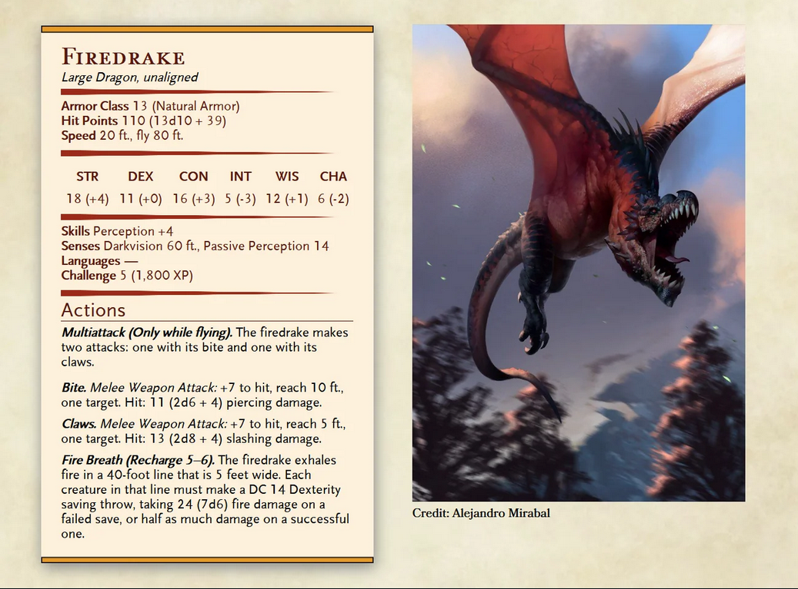

# The Wyrm of Wheatenbell

* The heroes get recruited in the city by the Garrison Captain Sigmund Evergeist. He asks them to investigate the alleged dragon sightings in the farmland outskirts of Wheatenbell. He is sceptical about it being an actual dragon, since he thinks they would be already dead, if it was one. Still, he is worried about the unrest in the town and cannot afford to disperse his guards to both city flanks due to the recent bandit raid attempts.

* Before the party acts, he advises them to ask the local population about some detail of the case. The party can talk to merchants (Dale Thorwild, Kamilla Al Nameri), commonfolk, town guards, and farmers (Lodd, Old Geller).

* The folks usually have just heard rumors and can't really give any details except that they know there were fires in the fields and some livestock started to disappear. The commoners are superstitious and are afraid.

* The guard won't give out any information not to cause chaos but neither do they know any details. Some are sceptical and some are just as scared.

* Merchants will direct the party to the farmers, equally worried or uncaring and waiting to leave town.

* The farmer party can meet is called Lodd Oatlin. He is more angry than scared. He talks about weird sounds in the night when he was at the field farmhouse, like screams of cattle and sounds of large wings flapping. The only thing he saw when he ran out was a large shadow flying away in the night sky and several sheep dead on the ground. He also tells the party about the burned down farmhouse of Old Geller. The old man himself is currently unconcious and recovering from burns. The fire happened two days ago. From time to time some fires have started in the fields destroying crops.

* If the party visits Old Geller he remains unconcious and the medics will not let the party in.

* The party will follow Lodd to his farmhouse on the other side of the Chiothar river. The party can go investigate the burned down farmhouse, the field fires, or The Wood of Sharp Teeth, trying to find some clues.

* In the fields they will find ashes and a couple of sheep carcasses.

* The burned down farm will not hold anything but obvious large fire traces and a couple of large clawed footmarks.

* In the woods the party might find a pack of wolves (fight).

* In the end of the day Lodd proposes that they spend the night here, in his farmhouse. During the night the party will hear flapping of large wings and screams of sheep. When they run out they will see a couple giant vultures attacking livestock (fight). The feet are awfully similar to the footprints found at the burned down farm.

* When the party kills them they can inform Lodd about this, relieving him greatly. They can go back and report to Sigmund yet the fires remain unexplained. He tells them that Old Geller woke up. He will convince the party that the dragon is real, allegedly seeing a part of him through the window. He will ask the party to go to his farm and retrieve a small chest hidden under the floor with some possessions.

* When the party comes back to the burned down farm, start Fire Drake encounter (fight).

* When the party kills him, they will come back and tell the truth to Sigmund and receive their reward.

<br>

## Stats

```
Commoner
```


<br><br>

```
Guard
```


<br><br>

```
Sigmund Evergeist
```


<br><br>

```
Wolf
```


<br><br>

```
Direwolf
```


<br><br>

```
Bear
```


<br><br>

```
Giant Vulture
```


<br><br>

```
Fire Drake
```


<br><br>